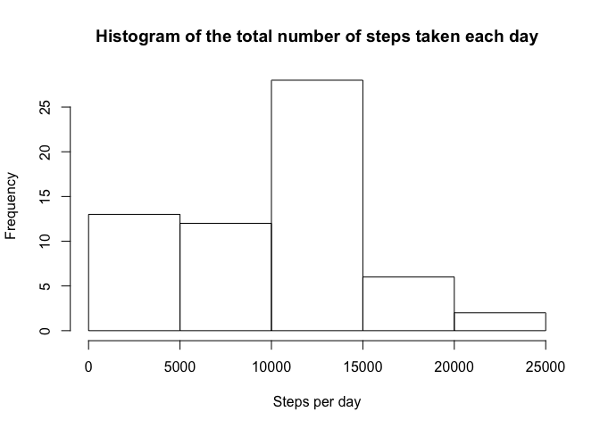
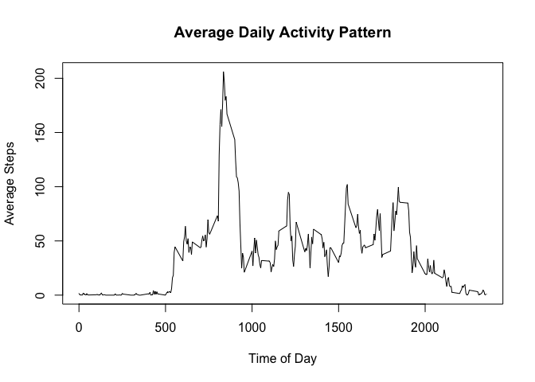
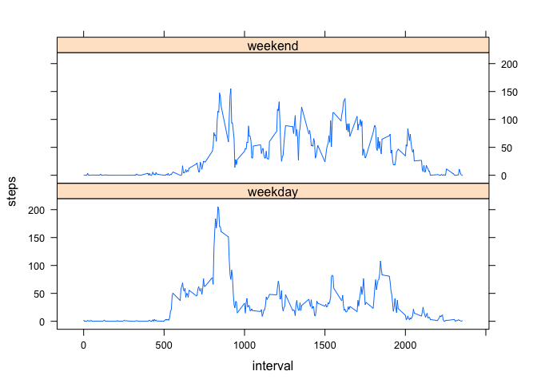

# Reproducible Research: Peer Assessment 1


## Loading and preprocessing the data

Unzip the zipped datafile if we haven't already.

```r
if (!file.exists("activity.csv")) {
  unzip("activity.zip")
}
```

Load the data

```r
data <- fread("activity.csv")
```

Parse the date field into dates.

```r
data <- transform(data, date=ymd(date))
```

## What is mean total number of steps taken per day?

Calculate the total number of steps taken per day

```r
total_steps <-
  data %>%
  group_by(date) %>%
  summarize(steps=sum(steps, na.rm=TRUE))
```

Make a histogram of the total number of steps taken each day

```r
hist(total_steps$steps, xlab="Steps per day", main="Histogram of the total number of steps taken each day")
```

 

Calculate and report the mean and median of the total number of steps taken per day

```r
results <- summarize(total_steps, mean=mean(steps), median=median(steps))
```
* Mean is 9354.2295082.
* Median is 10395.

## What is the average daily activity pattern?

Plot average daily activity pattern

```r
steps_by_interval <-
  data %>%
  group_by(interval) %>%
  summarize(average_steps=mean(steps, na.rm=TRUE))
plot(steps_by_interval,
     type="l",
     main="Average Daily Activity Pattern",
     xlab="Time of Day",
     ylab="Average Steps")
```

 

```r
max_interval <- steps_by_interval$interval[which.max(steps_by_interval$average_steps)]
```
Interval with the highest average step count is: 835.

## Imputing missing values


```r
na_count <- sum(is.na(data$steps))
```
Total number of missing values in the dataset is 2304.

Each missing value is going to be assigned the median value for that interval.


```r
imputed_data <-
  data %>%
  group_by(interval) %>%
  mutate(median_steps=median(steps, na.rm=TRUE)) %>%
  transmute(steps=ifelse(is.na(steps), median_steps, steps), date=date, interval=interval)
```

Calculate the total number of steps taken per day

```r
total_steps <-
  imputed_data %>%
  group_by(date) %>%
  summarize(steps=sum(steps, na.rm=TRUE))
```

Make a histogram of the total number of steps taken each day

```r
hist(total_steps$steps, xlab="Steps per day", main="Histogram of the total number of steps taken each day")
```

 

Calculate and report the mean and median of the total number of steps taken per day

```r
new_results <- summarize(total_steps, mean=mean(steps), median=median(steps))
```

<table>
 <thead>
  <tr>
   <th></th>
   <th>Original Data</th>
   <th>New Data</th>
  </tr>
 </thead>
 <tr>
  <th>Mean</th>
  <td>9354.2295082</td>
  <td>9503.8688525</td>
 </tr>
 <tr>
  <th>Median</th>
  <td>10395</td>
  <td>10395</td>
 </tr>
</table>

Median is unchanged (which isn't surprising since we used median to fill in NA values). Mean is slightly changed.

## Are there differences in activity patterns between weekdays and weekends?

Add “weekday” and “weekend" factor vector.

```r
weekended <-
  imputed_data %>%
  mutate(weekday=ifelse(weekdays(date) %in% c("Saturday", "Sunday"),
                        "weekend", "weekday")) %>%
  mutate(weekday=factor(weekday))
```

Make a panel plot containing a time series plot (i.e. type = "l") of the 5-minute interval (x-axis) and the average number of steps taken, averaged across all weekday days or weekend days (y-axis). 


```r
averaged_by_weekday <-
  weekended %>%
  group_by(weekday, interval) %>%
  summarize(steps=mean(steps))
with(averaged_by_weekday, xyplot(steps ~ interval | weekday,
                                 type="l",
                                 layout=c(1,2)))
```

 
